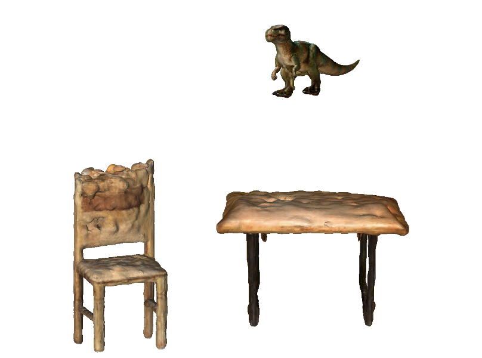
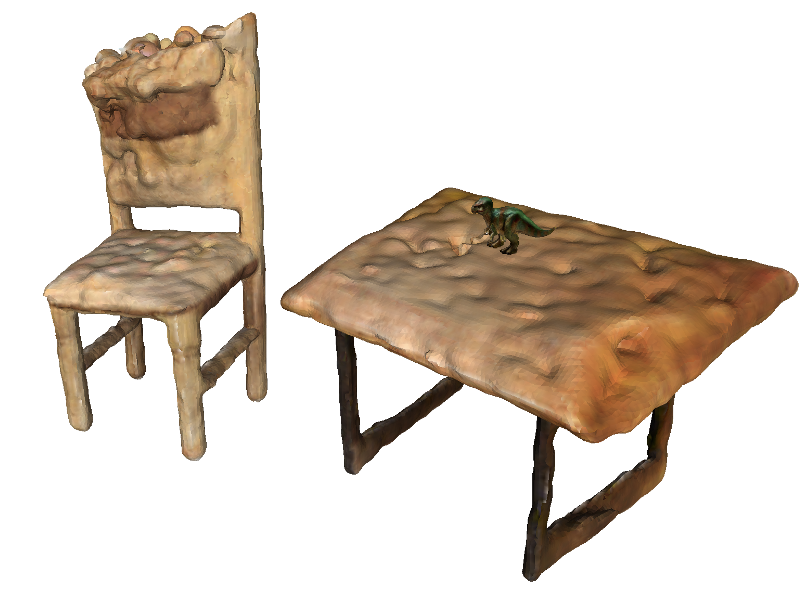
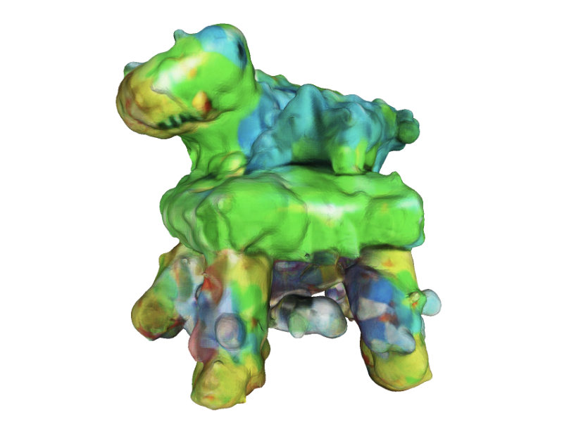

# CompoDreamer: Compositional 3D Scene Synthesis from CLIP Guidance

This an implementation for using CLIP scores to optimize the composition of meshes generated by [DreamGaussian](https://dreamgaussian.github.io/). We found this work, [GraphDreamer](https://graphdreamer.github.io/), that solved a similar problem to ours and did it really well, be sure to give it a look.

This is a course project for [16-825](https://learning3d.github.io/) at CMU.  


## Abstract
Recent advances in text-to-image diffusion models have spurred initiatives to leverage these models for enhancing text-guided 3D modeling. Commonly, methods focus on creating an object-level 3D model based on simple text inputs. However, this approach has limitations, particularly when the text describes intricate scenes with numerous objects. In this work, we explore a hierarchical 3D scene generation pipeline. First, we use text-to-3D methods like [DreamGaussian](https://dreamgaussian.github.io/) to generate object-level meshes. Then, we will optimize the positions, orientations, and scales of these meshes based on CLIP scores (we tried SDS, but it didn't work well).

## Example

Given **Text Prompt: "A chair and a table with a toy dinosaur on it."**
1. We first use [DreamGaussian](https://dreamgaussian.github.io/) to generate seperate meshes for **a chair**, **a table** and **a toy dinosaur**. 
2. Then, we use a LLM, such as GPT4, to get the intial positions of these meshes in a 3D scene. 
3. Finally, we use our pipeline to optimize the configuration of the scene.

| Initial Meshes | Optimized Meshes | Baseline (Dream Gaussian) |
| :---: | :---: | :---:|
|  |  |  |


## Environment Setup
This repo may requrie the following packages: 
  - torch
  - pytorch3d
  - open3d
  - imageio
  - scikit-image


## Run
``` 
python train.py
```
